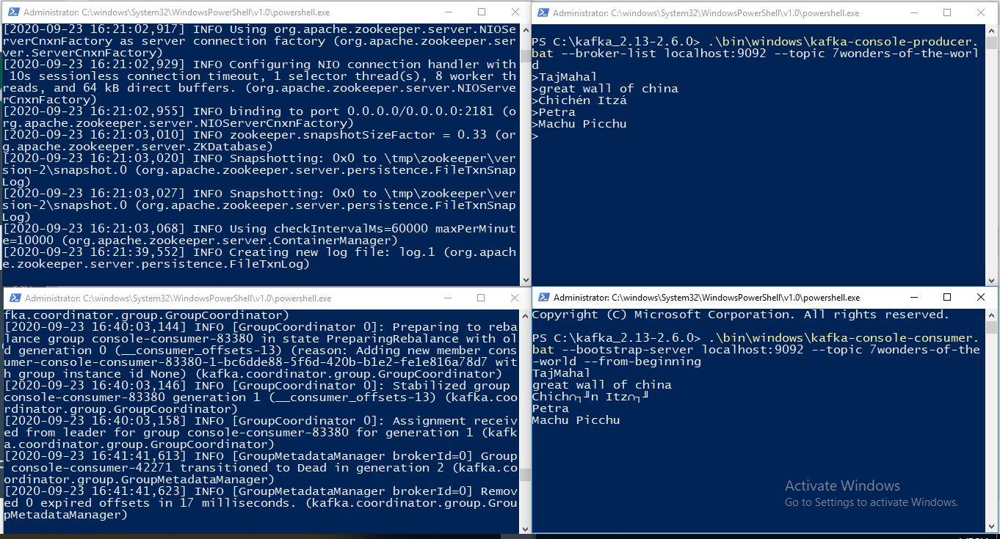

# Kafka-installation
## Install Maven & OpenJDK
- choco list -l
- choco install maven -y
- choco install openjdk -y
- refeshenv
## Install Kafka
- download kafka at [kafka.apache.org](https://kafka.apache.org/quickstart)
- move the dowloaded file to c:\ folder
- open powershell ,extract the downloaded file using the command tar -xzf <filename> 
- once the file is extracted open the folder by the cd <folder> command
## Check for the environmental variables
- JAVA_HOME = C:\Program Files\OpenJDK\jdk-version folder
- KAFKA_HOME =  C:\kafka-version folder
- M2_HOME = C:\ProgramData\chocolatey\lib\maven\apache-maven-version
- Path - must include (make sure you have only one JDK location in your path!)
   - %JAVA_HOME%\bin OR C:\Program Files\OpenJDK\jdk-version\bin (or similar, NOT both!)
   - %M2_HOME%\bin
   - %KAFKA_HOME%\bin
   - %KAFKA_HOME%\bin\windows
 ## Steps to run kafka and zookeeper
 - open the kafka folder and run the below commands
 - keep the below windows open:
   - Zookeeper service :``` .\bin\windows\zookeeper-server-start.bat .\config\zookeeper.properties ```
   - Kafka service : ``` .\bin\windows\kafka-server-start.bat .\config\server.properties ```
 - To execute one time commands in new window and close it
   - ``` .\bin\windows\kafka-topics.bat --zookeeper localhost:2181 --replication-factor 1 --partitions 1 --create --topic topic-name ```
   - ``` .\bin\windows\kafka-topics.bat --zookeeper localhost:2181 --list ```
 - To run producer and consumer 
   - ``` .\bin\windows\kafka-console-producer.bat --broker-list localhost:9092 --topic topic-name ```
   - ``` .\bin\windows\kafka-console-consumer.bat --bootstrap-server localhost:9092 --topic topic-name --from-beginning ```
  
  ## Service windows with output
  - 
